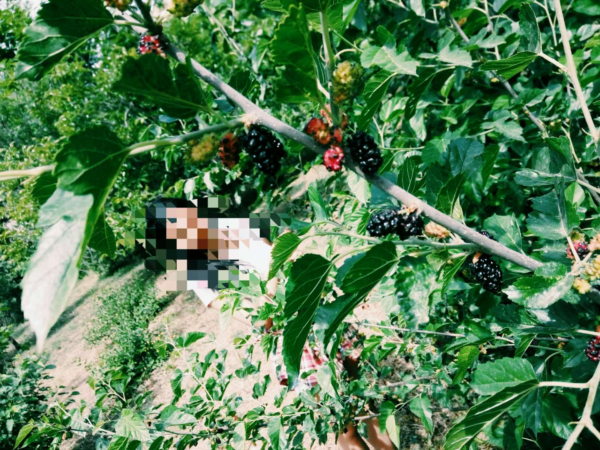
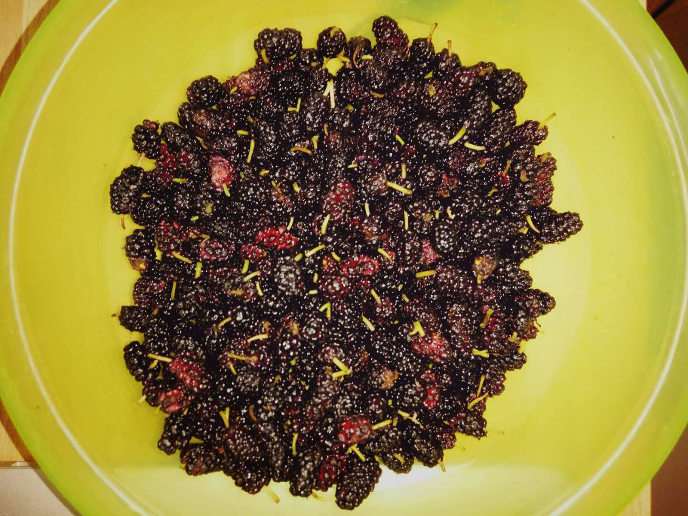

title: "周末日记-摘桑葚"
date: 2017-05-14 21:40:00 +0800
update: 2017-05-14 21:40:00 +0800
author: me
cover: "-/images/sangshen.jpg"
tags:
    - 生活
    - 周末
preview: 桑葚熟了。

---

> 2017-05-14 周日 晴

## 摘桑葚
院里山下有一块地，种了不少桃树、李子树和桑树。今年桑葚特别多，我和宝子早已观望许久。这周终于熟了。为了避开炎热，上午八点，算是起了个早，感到山下。采摘的大部队还没有来，我们算是占了先。

这里桑树真不少，都长满了桑葚，一部分已经成熟了。但是树比较高，不好摘，我们俩摘了一阵，也没收获太多。最后索性直接在地上捡了，因为地上都是熟透了的桑葚，都紫得发黑了，特别甜。
陆续换了几棵树，有一颗小树采光很好，果实又大又甜；还有一颗很矮的，虽然果实很小，但是成熟的好，非常甜，我们在其上面收获颇丰。

上一张采摘之余拍的照片：

## 采摘成果
最后小秀一下今天的战利品，图中大约有今天的四分之一：
