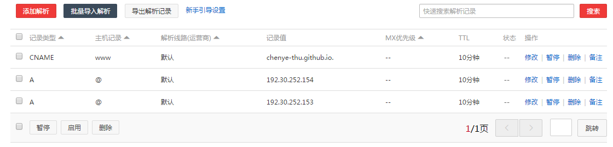

title: "个人域名购买-绑定GitHub Pages"
date: 2017-05-27 16:00:00 +0800
update: 2017-05-27 16:40:00 +0800
author: me
# cover: "-/images/xxx.jpg"
tags:
    - Web
    - 域名
    - 技术
preview: 在阿里云购买了域名，并与GitHub Pages里的博客绑定。

---

> 2017-05-27 周六 晴 山东潍坊 家里

## 购买域名
为什么购买域名？原因只有一个，ZHUANGBI。囧……

想拥有一个个人的域名，经过向大神博哥咨询后，查了跟多域名注册网站：国内的有[阿里云](https://www.aliyun.com/)、[腾讯云](https://www.qcloud.com/)和[百度云](https://cloud.baidu.com/)等，国外的有[name.com](https://www.name.com/)、[godaddy.com](https://sg.godaddy.com/zh/)等。

一般域名购买第一年都比较便宜，最便宜的只有几块钱，但是我还是想买的时间长一些，想一直用，因此想买个五年或者十年，那就要看续费价格了。经过研究，还是国内网站上一些不怎么常见的域名比较便宜，比如阿里云的`.bid`、`.loan`、`.win`、`.party`、`.date`、`.trade`、`.science`等每年只要7元，`.market`、`.pub`、`.studio`每年9元（[阿里云域名价格表](https://wanwang.aliyun.com/help/price.html?spm=5176.8048432.308878.27.vcBKcx)）；百度云的`.bid`每年只要6元，`.trade`、`.club`每年9元（[百度云域名价格表](https://cloud.baidu.com/product/bcd/price.html)）。

因为只是给自己个人博客用而已，不需要`.com`这种，肯定越便宜越好。经过考虑，还是选择阿里云，感觉`.science`域名听上去很牛逼，而且价格便宜，并且[chenye.science](http://chenye.science)好没有人注册，那必须决定是它了。十年只要68元，首年便宜了2元。调研还是有用啊，前一阵差一点花五六百去买域名了。

## 域名绑定GitHub Pages
有了域名之后，就着手绑定GitHub上的博客了。

非常简单，参考了这篇博文：[GitHub Pages 绑定域名](http://blog.csdn.net/u013282507/article/details/54944395)

1. 首先在项目里添加一个名为`CNAME`的文件，里面写上要绑定的域名，如`chenye.science`。
2. 在阿里云个人的控制台，找到相应的域名，并点击“解析”，添加三个解析如下图。

大功告成！查看我的博客：[chenye.science](http://chenye.science)