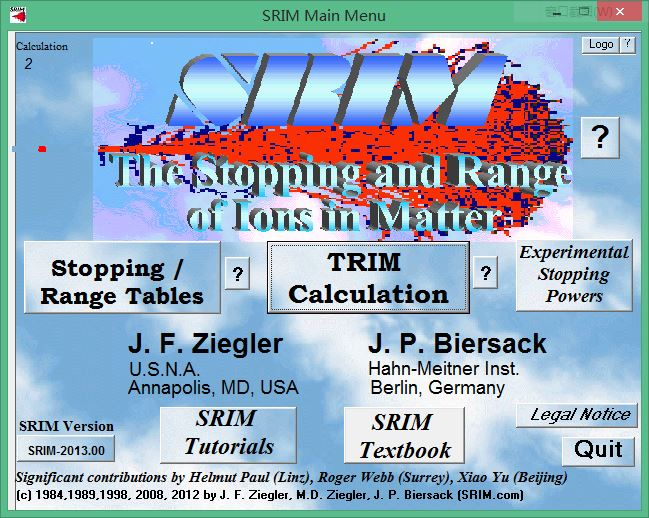

title: "离子在物质中的能损和射程计算软件——SRIM的安装"
date: 2017-10-23 19:00:00 +0800
update: 2017-10-23 19:55:00 +0800
author: me
cover: "-/images/srim-01.jpg"
tags:
    - SRIM
    - 核物理
    - 蒙卡
preview: 离子在物质中的能损和射程计算软件——SRIM（The Stopping and Range of Ions in Matter）的安装。

---

> 2017-10-23 周一 晴 北京 北京大学

## 1 SRIM软件介绍 ##

**[SRIM](http://www.srim.org/)**（The **S**topping and **R**ange of **I**ons in **M**atter）是核物理、粒子物理相关专业常用的一个软件，顾名思义，即计算“离子”在物质中的能量损失和射程。这里的“离子”其实并不是我们一般所知的离子，在SRIM中，对所有处于移动中的原子，都统称为“离子”。

SRIM网站地址：[http://www.srim.org/](http://www.srim.org/)

## 2 SRIM软件的安装 ##
SRIM软件的安装十分简单：

1. 首先在其网站[http://www.srim.org/SRIM/SRIMLEGL.htm](http://www.srim.org/SRIM/SRIMLEGL.htm)上下载安装文件***SRIM-2013.e***。
2. 在你想要安装软件的目录新建一个文件夹“SRIM-2013”，将安装文件复制在此，并修改其后缀名为**exe**（***SRIM-2013.exe***）。
3. 双击安装文件，会提示你进行解压，选择解压后，软件的文件将解压到当前目录中。目录中的***SRIM.exe***文件即主程序文件。
4. 如果你的电脑之前使用过SRIM，那么此时安装已经完成了，直接打开***SRIM.exe***即可运行程序；如果你是第一次使用SRIM，那么运行软件可能会遇到问题。此时进入
***SRIM-Setup\SRIM-AutoSetup***目录中，右键单击***SRIM AutoSetup.exe***文件，选择“**以管理员身份运行**”，进行软件的自动配置。配置完成后，软件的安装完毕。此时再运行***SRIM.exe***即可。

