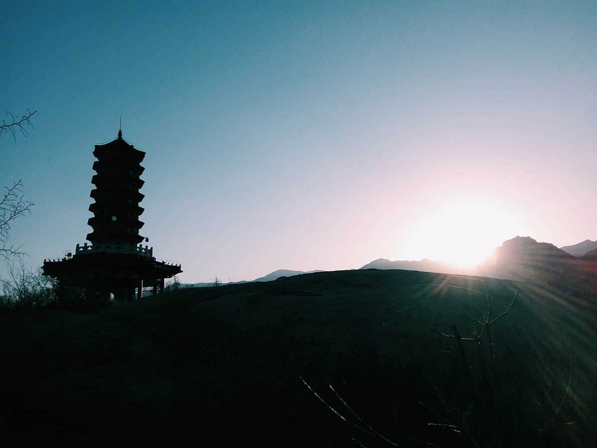

title: "诗一首——山顶"
date: 2017-10-25 13:20:00 +0800
update: 2017-10-25 13:25:00 +0800
author: me
cover: "-/images/mountain-top.jpg"
tags:
    - 诗
preview: 诗一首——山顶

---

> 2017-10-25 周三 阴 北京 北京大学

## 山顶 ##
*夜凉如水*

----------

黄昏和塔 
时光和虚度 
在那山顶上 盘起腿  
将青春修炼成灰 

消息在闯入 
闯入 
我的城堡 
我灰头土脸 不说 
天涯 路人 
我想逍遥法外 

我想把十七岁再过一遍 
新年和旧日已经碰撞 
我的世界 像个孩子一样 
让我一醉方休 逆着光 
我的向往 

就这样吧 让我长眠于此 
当我无家可归的时候 
那阵风仿佛你的眼神 
嘘，请保持安静 

*（作于 2016.2.20 北京）*