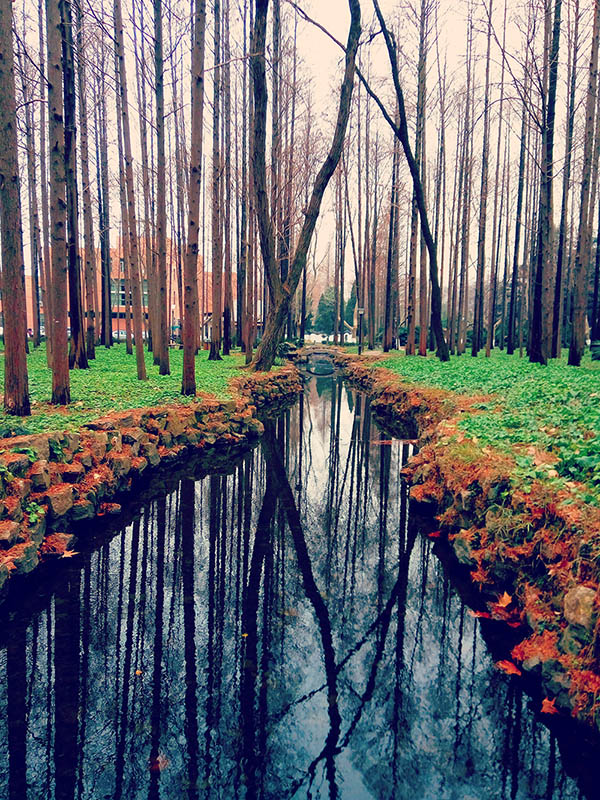

title: "诗一首——我的河流"
date: 2017-10-25 13:00:00 +0800
update: 2017-10-25 13:10:00 +0800
author: me
cover: "-/images/river-web.jpg"
tags:
    - 诗
preview: 诗一首——我的河流

---

> 2017-10-25 周三 阴 北京 北京大学

## 我的河流 ##
*夜凉如水*

----------

有一扇门 我打开它 
然后行走在河里 
眼睛是一支画笔 
在昼夜不息里涂抹着阳光和星辰 
河流也是不息的 
我逆流而上的时候天空飘着一万个眼神就像红色的羽毛 
一路上季节交替里我看到落叶和飞过的候鸟 
结束已经开始 
后果却找不到原因 
如果我可以回头 也只能看着 
码头上的人眼睁睁把我遗忘 
我眼睁睁看着流水带走旧日 
季风带走我最爱的一片云 
烈日带走我的河流干涸了丛林 
然后 我行走在不息的河道里 
行走在大地的裂缝里 
好像人们都已四散奔逃 
只剩下一根枯瘦的天空我看不懂它似乎是在笑 
它似乎是在嘲笑 
就好像我要被埋葬在这里了 

*（作于 2016.3.9 北京）*