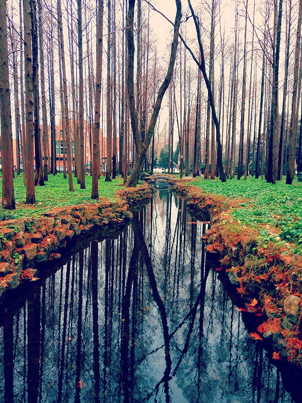

title: "诗一首——河流"
date: 2017-10-25 13:30:00 +0800
update: 2017-10-25 13:37:00 +0800
author: me
cover: "-/images/river-web.jpg"
tags:
    - 诗
preview: 诗一首——河流

---

> 2017-10-25 周三 阴 北京 北京大学

## 河流 ##
*夜凉如水*

----------

我们，对 
我，和你，以后 
一定要有一条河流 
为此哪怕失去一切，也是 
幸福的 
早晨，我们，对 
只有我，和你 
我们坐在岸上 
看太阳从对面慢慢伸过手来 
河水很浅 
但味道是甜的，像 
你的嘴角和眼神 
是幸福的 
河岸上的草都是矮的，还有 
不知名的花 
你忍不住摘下一朵来 
没有关系 
都是我们的 
我们整天赤着脚 
我们踩在河里 
我们躺下，河水很浅 
我们枕着石头，不用说话 
是幸福的 
傍晚，河流 
变成红色，像你的脸一样 
我抱起你来，不用回家 
河流就是我们的家 
太阳走了，晚上也是我们的 
我们坐在草地上 
草地是我们的，晚风也是我们的 
月亮也是我们的，它在我们的 
河流里，像你的眼睛 
是幸福的 
我们躺下，整个星空都是我们的 
像你的头发 
流星也是我们的，一生都是 
你枕着我的手臂，我看着你 
月亮看着我们 
河流看着月亮，都不说话 
是幸福的 
我们的河流不大，草地也不大 
但是，我们有故事 
我们爱河流，河流是 
我们的生命和时光，都在 
河流里，是幸福的 
月亮走了，早晨也是我们的 
草和土地都不说话 
我们赤着脚，挽着裤腿 
去河流里，河水很浅 
但阳光是温暖的，像 
你的嘴角，是幸福的 
我们打闹，脸上都是 
河水和泥土，都是 
我们的，我们的世界不大 
但是简单 
我们有回忆，我们的回忆 
和泥土一样干净 

*（作于 2016.3.25 北京）*