title: "Creating Your Personal Website for Free"
date: 2017-10-29 12:30:00 +0800
update: 2017-10-29 12:50:00 +0800
author: me
cover: "-/images/github02.jpg"
tags:
    - English
    - Presentation
    - web
    - 技术
preview: Creating your personal website for free. Draft of Oral English Informal Presentation 01.

---

> 2017-10-29 Sunday. Sunny. Beijing. PKU

## Creating Your Personal Website for Free ##

We surf the internet almost every day. But have you ever thought of having a website of your own? Imagine that if you had your own personal website, you could design it according to your ideas, you could put whatever you want on it, and you could share it with friends, and people all over the world could see it through the Internet. That’s cool. Right? OK. Today I will tell you how to create your personal website for free. 

I will share four things with you. 

- Firstly, we need to know where to put our websites on. Yes, we will use GitHub. 
- Secondly, we should make website files. 
- And then, we need to upload these files. After that you will have your own website. 
- But if you want it to be cooler, I have one more thing to show you.

---

### 1 Where to put your website on? GitHub ###

Now let’s begin. Part one. GitHub is a popular website among programmers, it can host public webpages for us for free.
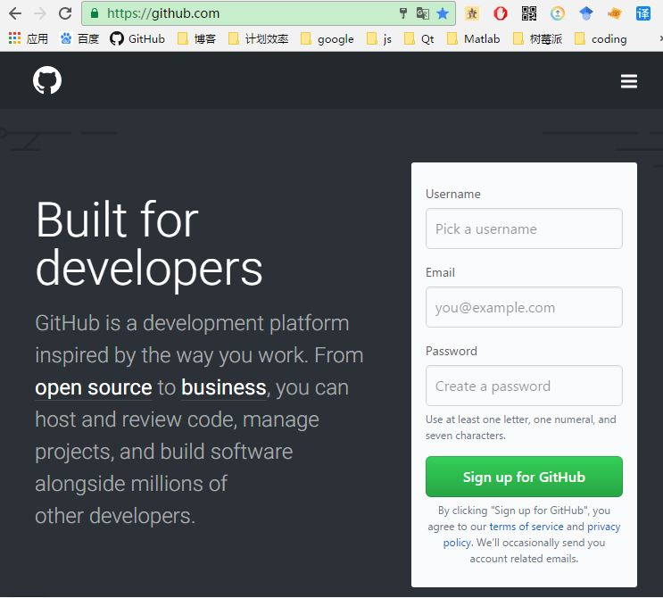
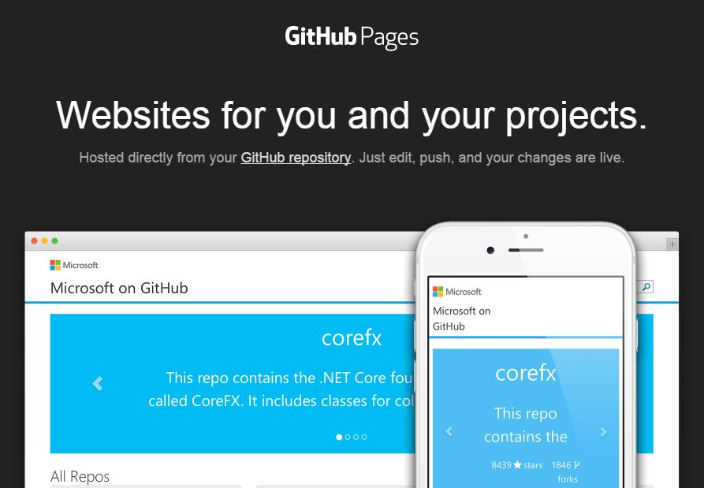

 You need to register on it. And you will get your user name, such as “username”. 
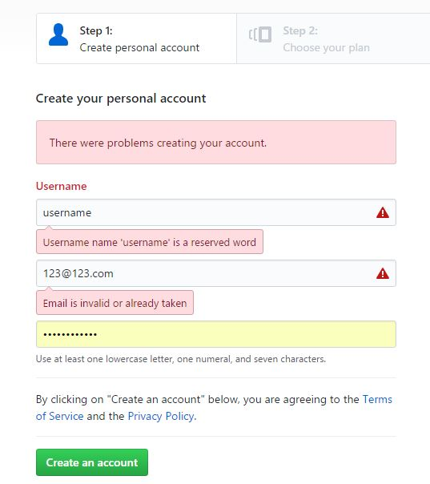

And then, you can create a repository. A repository is just like a project. We will put our website files in it. Remember that the repository name must be “***username.github.io***”. 
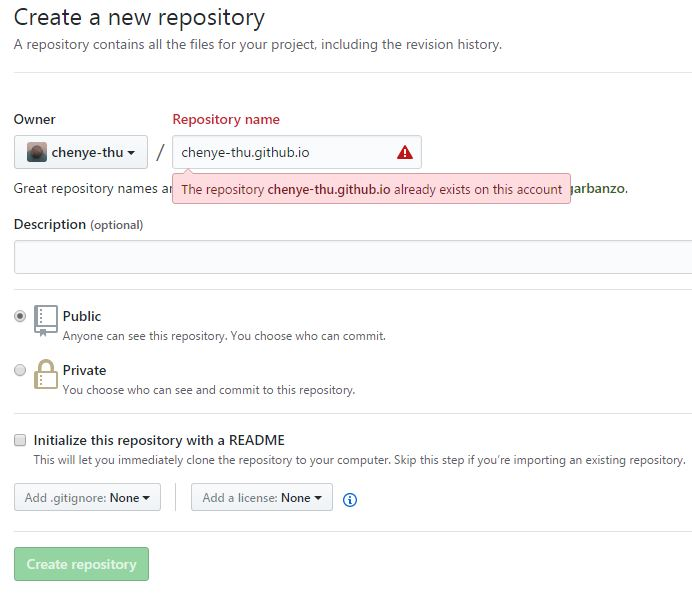

### 2 Making website files ###
OK. After that we should make website files. It is helpful if you know the basics of **HTML**, **CSS** and **JavaScript**. But it’s not necessary. If you want to create a blog website, there are many **tools**(Jekyll/Mweb/InkPaper) available to create website files. And maybe we need to know a little bit of **Markdown** language, but it’s very easy. We can just learn it by doing.

Well, for example, I want to create a blog website, and I select [InkPaper](http://www.chole.io/) as my tool. You can download it, and there is no need for installing. 
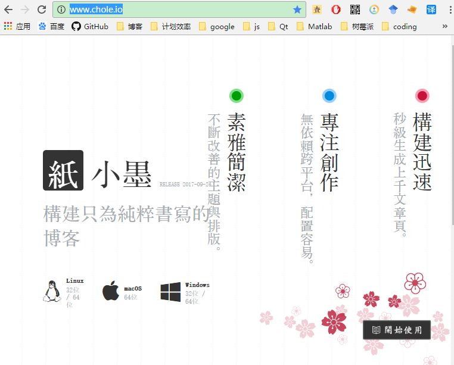

And then I prepare Markdown files, where I write my artcles in. Markdown is very easy. All we have to do is writing like this. 
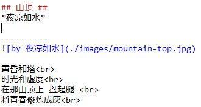

After that, we can use InkPaper to generate website files. Just one command. It’s very easy. 
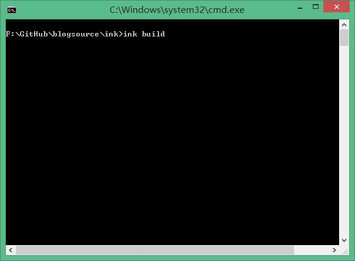

Then the Markdown files will be translated into website files.

### 3 Uploading website files to GitHub ###

OK. Now it’s time to upload these website files. The easiest way is to use [**GitHub Desktop application**](https://desktop.github.com/). You can download and install it, and sign in. 
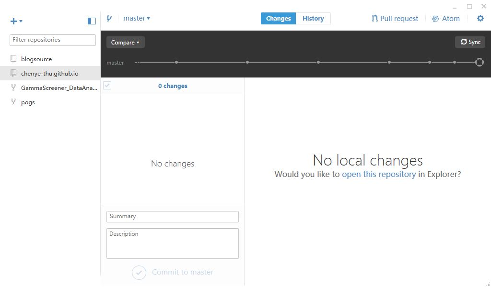

Then you need to **clone** your repository to local PC. And copy your website files into it. 
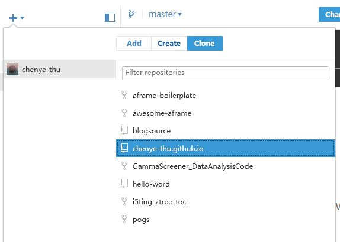
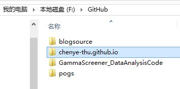

Then you can see changes in the application. Just “**Commit**”, and then **synchronize** the data. 
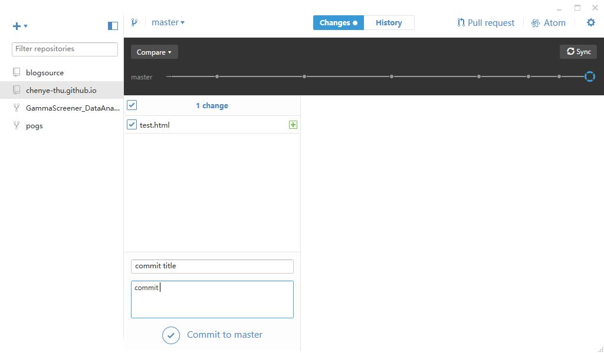

Done！Now you have created your website. You can type “username.github.io” in your browser, and you will see it. It’s pretty cool! Right?
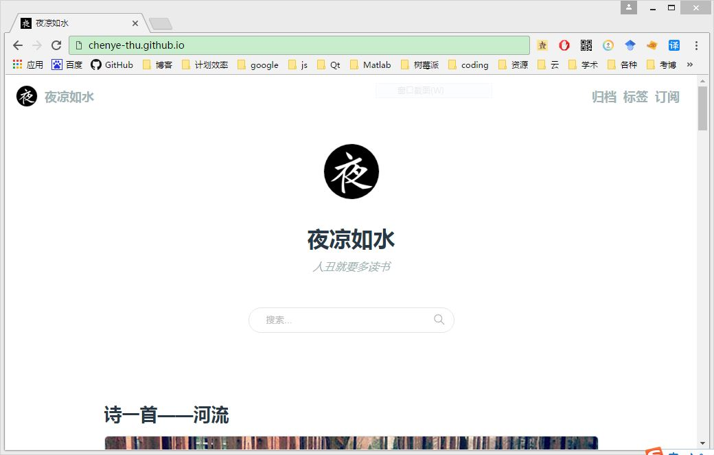

### 4 Want it to be cooler? ###
But, If you want your website to be cooler, look at this. You know, every website has its **domain name**. Google’s domain name is “google.com”, and Tencent’s domain name is “qq.com”. So it’s pretty cool to have your own domain name. Right? 

OK. You might have to spend a little money on this. I have bought one domain name: [chenye.science](http://chenye.science). And it only cost me 68 yuan for 10 years’ usage. It’s very cheap. 

After that, create a file named “***CNAME***”, and write your domain name in it. And add it to your repository.
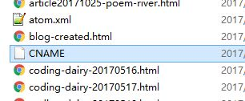
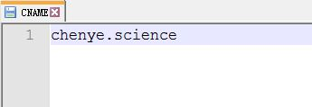

And then, go to the website where you buy the domain name, and **resolve the domain** name to GitHub. It will connect the domain name to your website.
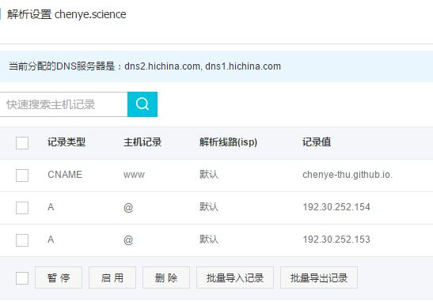

Now you can open your phone’s browser, and type “[chenye.science](http://chenye.science)”, and you will see my website. I have put some articles on it. And you can read them.

Well, that’s all, thank you!
