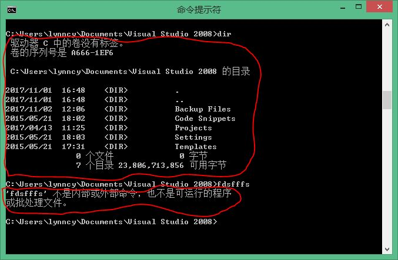
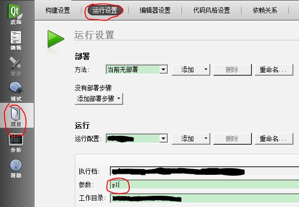

title: "利用cmd命令建立Qt（C++）程序与MATLAB数据接口"
date: 2017-11-04 10:00:00 +0800
update: 2017-11-04 14:00:00 +0800
author: me
# cover: "-/images/sangshen.jpg"
tags:
    - 编程
    - MATLAB
    - Qt
preview: 编程记录：利用cmd命令建立Qt（C++）程序与MATLAB数据接口。MATLAB通过执行命令行（cmd）命令，运行Qt（C++）程序，并获得Qt程序返回的数据。

---

> 2017-11-04 周六 晴 北京 清华大学

## 利用cmd命令建立Qt（C++）程序与MATLAB数据接口 ##
### 1 为什么要用cmd命令？ ###
因为简单，真的……因为实在是整不出其他办法来TT。

本来想通过Qt生成动态链接库（DLL），在MATLAB中调用，但是这个方法最多支持一些简单的程序，稍微复杂一点，MATLAB就报错。我的Qt程序算是略复杂了，不仅有很多类，而且还要与硬件通信，所以这个方法行不通。

所以就想到MATLAB是不是可以执行系统命令，如果可以，是不是可以通过cmd执行我的Qt程序，并获取返回的数据呢？因此，查到这篇文章：[Matlab中使用系统命令](http://blog.sina.com.cn/s/blog_59cf67260100l2c3.html)。其实很简单，只有一个`system`函数而已，使用方法如下。其中，`status`代表执行是否成功（成功0，失败非0），`results`为执行程序返回的结果。

```
%MATLAB代码：执行系统命令'command'
[status, results]=system('command')；
```

要注意的是，`results`是命令行程序的返回结果。什么意思呢，我们知道，命令行程序是通过将信息“打印”（如`printf`、`cout`）到命令行界面来显示结果的。所以`results`其实就是程序运行后，命令行界面上打印出来的信息。说白了，`results`就是一个字符串而已。如下图所示，在命令行中执行`dir`，会将当前目录下的文件打印出来；而如果执行一个不存在或者未找到的命令，同样会有信息打印出来，而`results`中保存的正是这些信息。



因此，MATLAB通过`system`函数，运行Qt程序，得到了字符串`results`，这之后还要对字符串进行处理，才能获得最终想要的数据。那么这就要求在编写Qt程序时，要对输出结果建立一定的协议，保证MATLAB能够按照协议获取想要的数据。

### 2 Qt中编写命令行程序 ###

#### 2.1 Qt中获取和解析cmd参数 ####

Qt用的就是C++语言，编写cmd程序和纯C++是一样的。我们最开始学习C/C++的时候，编写的都是命令行程序，例如我们的**helloworld**程序，不就是在命令行界面打印出“Hello world！”吗？

这里我们的cmd程序，比**helloworld**稍微复杂一点，是包含参数的程序。例如，我们在cmd中想要转换目录的话，需要用到`cd`命令，其用法是`cd [directory]`，这其中的`[directory]`就是程序的参数。

其实我们应该知道，C++程序的`main()`函数有两个参数`argc`和`argv`，如下面所示。其中argc是参数个数，argv里则是程序的参数。那么通过这`argc`和`argv`两个参数就可以得到程序的参数，进而进行命令的解析。要注意的是`argv[0]`是程序本身的名字，从`argv[1]`开始才是程序的参数，例如命令`cd [directory]`，`argv[0]`是"cd"，`argv[1]`才是"[directory]"。因此，当`argc`大于1的时候，才说明程序是由参数的。

```cpp
int main(int argc, char *argv[])
{
	...
}
```

从`argv`中得到的参数，需要进行解析。我的需求是不同的参数对应程序不同的操作。假设我的程序名为“myProgram”，我希望在我输入`myProgram p1`和`myProgram p2`时执行不同操作。

很简单，只需要把`argv[1]`转换成`QString`类型，然后可以直接使用`==`符号来判断，如下所示。
```cpp
if(argc > 1)
{
    if(QString(argv[1]) == "p1")
        ...;
    else if(QString(argv[1]) == "p2")
        ...;
	...
}
```

#### 2.2 在Qt GUI程序中加入cmd模式 ####

我的Qt程序之前是一个GUI（图形界面）程序，一般来说。在此基础之上，即使你在`main()`函数中加入了参数解析等cmd运行的操作，你也不会得到你想要的结果。这是因为Qt一般会默认GUI程序没有cmd操作。

因此，我们需要在Qt项目的***.pro***文件中，加入一句：`CONFIG += console`。这样再生成的程序就可以在cmd中带参数运行了。

#### 2.3 在Qt中调试cmd命令 ####

那么问题又来了，有的时候，你可能想要对cmd命令的参数进行调试，然而在Qt Creator中只有一个调试按钮，默认是没有参数的。

其实，运行的参数是可以设置的。参考这篇文章： [QtCreator调试传入运行参数](http://blog.csdn.net/desert187/article/details/40781225)。在Qt Creator中，找到**项目**->**运行设置**->**参数**，在这里写上想要调试的参数即可。如下图所示



#### 2.4 cmd程序输出（打印）协议制定 ####

协议制定的目的是为了让MATLAB方便地在输出结果中找到想要的内容。

我参考了***XML***格式，将数据打印出来。例如，当运行`myProgram p1`时，我需要将0~9的整数打印出来，而这些数就是我想传给MATLAB的数据。我可以使用下面代码实现：

```cpp
printf("<p1>");
for(int i = 0; i<10; i++)
    printf("%d ", i);
printf("</p1>");
```

以上代码的输出结果如下所示，对于这样的结果，在MATLAB中，只要在`results`找到"<p1>"和"</p1>"的位置，就可以得到0~9的数据了。

```
<p1>0 1 2 3 4 5 6 7 8 9 </p1>
```

当然，实际使用时，可能为了鲁棒性，还要加一些其他的输出信息。比如**是否有数据输出**、**数据个数**等等。就是说，协议制定要全面一些。

### 3 MATLAB对cmd输出（results）的解析 ###

参考这篇文章：[matlab 字符串处理函数](http://www.cnblogs.com/emanlee/archive/2012/09/13/2683912.html)

使用MATLAB执行cmd程序后，得到的结果保存在`results`中，`results`是字符串类型的向量。从`results`中解析数据，需要用到以下几个函数：

```
%MATLAB代码
% 1. 从results中找到'<p1>'的位置k；如果有多个，k是向量
k = strfind(results,'<p1>');
% 2. 从results中取出数据部分（例如，从第a到第b个字符）
p1str = results( a : b )；
% 3. deblank可以把字符串后面的空格等去掉
p1str = deblank( p1str );
% 4. strsplit可以把字符串以空格等符号分开，返回cell类型
p1Cell = strsplit(p1str, ' ');
% 5. 将cell类型逐个转变为数字类型，最终得到1*10的向量p1
p1 = zeros(1, 10);
for id = 1:10
    p1(id) = str2double( cell2mat( p1Cell(id) ) );
end
```

利用上面几个函数，就可以很方便地把cmd返回结果中的数据提取出来了。

就到这吧，这篇文章还挺长的……