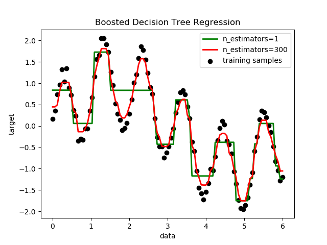

title: "基于Python的机器学习框架scikit-learn学习笔记01"
date: 2017-11-14 10:00:00 +0800
update: 2017-11-19 22:00:00 +0800
author: me
cover: "-/images/scikit-learn-example01.png"
tags:
    - 机器学习
    - Python
    - scikit-learn
    - 编程
preview: 基于Python的机器学习框架scikit-learn学习笔记01。

---

> 2017-11-14 周二 晴 北京 清华大学 开始<br>
> 2017-11-19 周日 阴 北京 清华大学 完成

## 1 scikit-learn是什么? ##
scikit-learn官网：[http://scikit-learn.org/](http://scikit-learn.org/)

为了做机器学习课上的作业，不得不从小白开始学习一些新的东西TT。

scikit-learn（简称sklearn）是一个基于Python语言的机器学习框架，这个东西好不好我也不太清楚。我也是看到助教和课上有同学说可以用这个来做作业，才决定了解下它的。

作业是在12月1日截止。看上去好像时间还很多，其实这期间，我得学会scikit-learn（了解、安装、使用），学着熟悉Python，做作业，写报告……想到这些心就好累呀。更不用说还有其它课程的作业了TT。

不过工欲善其事，必先利其器。学号一门工具还是很有必要的。希望自己在这两周里，加把劲，打开机器学习的大门。唉，其实，我只求这门课别挂TT。下面呢，就是边学习边记录，做一个学习笔记。

## 2 安装scikit-learn ##
我之前已经安装过Python 3.5，并且我发现，我已经有pip这个程序了（在：Python安装目录\Scripts里）。pip是一个Python包管理工具，用它可以很方便地安装scikit-learn。

参考这篇文章，下载了NumPy、SciPy、Matplotlib（以及pytz、dateutil、pyparsing）和sklearn的.whl安装包：[目前最全的windows平台下：scikit-learn安装教程](http://www.jianshu.com/p/21b758541825)。还参考了文章：[windows下python3.4的scikit-learn搭建](http://blog.csdn.net/Apie_CZX/article/details/45643941)

使用pip install安装下载的whl安装包（注：我没有加“-U”）
```
pip install –U xxx.whl
```
但是报错：
```
xxx_amd64.whl is not a supported wheel on this platform. 
```
经过检查后我发现我的Python是32位的，晕……当时是怎么想的……

重新下载了几个包的32位版本，安装顺利。

为了测试是否安装成功，去sklearn官网（[sklearn官网例子](http://scikit-learn.org/stable/auto_examples/index.html)）找了几个例子试了一下，运行成功！下图是一个决策树adaboost回归（拟合）的例子。



搞定！看来今天还是挺顺利的！而且，用起来真的很简单啊，从网页上复制代码过来，直接运行，什么配置都不需要！

## 3 scikit-learn的使用 ##
在运行了几个例子之后，我感觉scikit-learn的使用应该是比较简单的，而且我也大概看看看代码，多少还是能看懂的。后面可能要实现自己的功能的话，就要查文档或者百度谷歌了。

sklearn官网文档中找到了关于集成的部分：[1.11. Ensemble methods](http://scikit-learn.org/stable/modules/ensemble.html)。在这里面正好就有bagging和随机森林（random forest, RF），以及Adaboost。

官网关于bagging集成的例子：[Single estimator versus bagging: bias-variance decomposition](http://scikit-learn.org/stable/auto_examples/ensemble/plot_bias_variance.html)。这个例子讲的是bagging的回归模型 BaggingRegressor。当然，还可以找到bagging的分类器[BaggingClassifier](http://scikit-learn.org/stable/modules/generated/sklearn.ensemble.BaggingClassifier.html)。

### 3.1 BaggingClassifier ###
基于bagging的分类器[BaggingClassifier](http://scikit-learn.org/stable/modules/generated/sklearn.ensemble.BaggingClassifier.html)位于`sklearn.ensemble`。官方文档地址：[http://scikit-learn.org/stable/modules/generated/sklearn.ensemble.BaggingClassifier.html](http://scikit-learn.org/stable/modules/generated/sklearn.ensemble.BaggingClassifier.html)

BaggingClassifier定义：

```python
class sklearn.ensemble.BaggingClassifier(base_estimator=None, n_estimators=10, max_samples=1.0, max_features=1.0, bootstrap=True, bootstrap_features=False, oob_score=False, warm_start=False, n_jobs=1, random_state=None, verbose=0)
```

其比较重要的几个参数意义如下。其实默认的参数值应该就是我们需要的bagging，我们最多改改基学习器个数`n_estimators`。

| 参数          | 意义         | 默认            |       备注   |
| ------------- |-------------| -----          |         -----|
|base_estimator | 基学习器     | None，对应决策树 |             |
|n_estimators   | 基学习器个数  |   10           |     int型   |
|max_samples    | 样本抽取个数或比例  |   1.0     | 整数对应个数，小数则对应比例 |
|max_features   | 特征抽取个数或比例  |   1.0     | 整数对应个数，小数则对应比例 |
|bootstrap      |样本抽取是否放回|   True        |    bool型    |
|bootstrap_features|特征抽取是否放回|   false    |    bool型    |
|oob_score      |是否用bag外样本估计误差|        |    bool型    |


使用下面的代码训练了一个BaggingClassifier，真的非常简单。声明分类器，`fit`用于训练，`predict`用于分类。关于加载样本数据相关的内容，在本文的后面。
```python
import numpy as np
from sklearn.ensemble import BaggingClassifier

# 加载样本数据
dataset = np.loadtxt("krkopt.txt", delimiter=",")
X = dataset[:,0:6]
y = dataset[:,6]

# 训练分类器
bagging = BaggingClassifier()
bagging.fit(X, y)

# 测试：用训练好的分类器分类
xt = [[ 3., 2., 5.,7., 8., 6.],
      [ 3., 2., 5.,7., 8., 7.]]
yt = bagging.predict(xt)
print(yt)
```

另外，如果想要计算错误率的话，不用自己费事计算理论，直接用`Classifier.score(XTest, yTest)`就可以计算预测正确率。其中`XTest`是测试输入，`yTest`是与之对应的正确结果。

### 3.2 RandomForestClassifier ###
基于RF的分类器[RandomForestClassifier](http://scikit-learn.org/stable/modules/generated/sklearn.ensemble.RandomForestClassifier.html)位于`sklearn.ensemble`。官方文档地址：[http://scikit-learn.org/stable/modules/generated/sklearn.ensemble.RandomForestClassifier.html](http://scikit-learn.org/stable/modules/generated/sklearn.ensemble.RandomForestClassifier.html)

RandomForestClassifier定义：

```python
class sklearn.ensemble.RandomForestClassifier(n_estimators=10, criterion=’gini’, max_depth=None, min_samples_split=2, min_samples_leaf=1, min_weight_fraction_leaf=0.0, max_features=’auto’, max_leaf_nodes=None, min_impurity_decrease=0.0, min_impurity_split=None, bootstrap=True, oob_score=False, n_jobs=1, random_state=None, verbose=0, warm_start=False, class_weight=None)
```

其比较重要的几个参数意义如下。相比于BaggingClassifier，RandomForestClassifier没有`base_estimator`这一参数，因为RF的基学习机只能是决策树。RandomForestClassifier最重要的两个参数是基学习器个数`n_estimators`和特征抽取个数`max_features`。其他的参数，如`criterion`、`max_depth`等，都是决策树[DecisionTreeClassifier](http://scikit-learn.org/stable/modules/generated/sklearn.tree.DecisionTreeClassifier.html)的参数，在此不赘述。在对比bagging和RF时，只要这些都是默认的即可。

| 参数          | 意义         | 默认            |       备注   |
| ------------- |-------------| -----          |         -----|
|n_estimators   | 基学习器个数  |   10           |     int型   |
|max_features   | 特征抽取个数或比例  |  “auto”  | 整数对应个数，小数则对应比例; “auto”:sqrt(n_features); “sqrt”:sqrt(n_features)； “log2”：log2(n_features)； None：n_features. |
|criterion      |生成决策树时使用的标准| "gini"   |"gini"或"entropy"|
|bootstrap      |样本抽取是否放回|   True        |    bool型    |
|oob_score      |是否用bag外样本估计误差|        |    bool型    |


使用下面的代码训练了一个RandomForestClassifier，同样非常简单。声明分类器，`fit`用于训练，`predict`用于分类。

```python
import numpy as np
from sklearn.ensemble import BaggingClassifier
from sklearn.ensemble import RandomForestClassifier

# 加载样本数据
dataset = np.loadtxt("krkopt.txt", delimiter=",")
X = dataset[:,0:6]
y = dataset[:,6]

# 训练RF分类器
rf = RandomForestClassifier()
rf.fit(X, y)

# 测试：用训练好的分类器分类
xt = X[0:2,:]
yt_rf = rf.predict(xt)
print(yt_rf)
```

### 3.3 AdaBoostClassifier ###
基于AdaBoost的分类器[AdaBoostClassifier](http://scikit-learn.org/stable/modules/generated/sklearn.ensemble.AdaBoostClassifier.html)位于`sklearn.ensemble`。官方文档地址：[http://scikit-learn.org/stable/modules/generated/sklearn.ensemble.AdaBoostClassifier.html](http://scikit-learn.org/stable/modules/generated/sklearn.ensemble.AdaBoostClassifier.html)

AdaBoostClassifier定义：

```python
class sklearn.ensemble.AdaBoostClassifier(base_estimator=None, n_estimators=50, learning_rate=1.0, algorithm=’SAMME.R’, random_state=None)
```

其比较重要的几个参数意义如下。AdaBoostClassifier最重要的两个参数是基学习器`base_estimator`和基学习器个数`n_estimators`。其中`base_estimator`默认是`DecisionTreeClassifier`。

| 参数          | 意义         | 默认            |       备注   |
| ------------- |-------------| -----          |         -----|
|base_estimator | 基学习器     | 决策树分类器     |             |
|n_estimators   | 基学习器个数  |   50           |     int型   |
|learning_rate  | 学习率？不懂  |   1             |    float    |
|algorithm      | 算法        |    ‘SAMME.R’    |{‘SAMME’, ‘SAMME.R’} |
|random_state   | 与随机数生成有关|   none       |     int型   |

**11.17日遇到问题**：使用AdaBoostClassifier训练的分类器，不知道什么原因，正确率很低。是因为多分类?基分类器个数太少？还是因为我用的不对？搞不清楚。AdaBoostClassifier的基分类器要求应该为比较弱的分类器，那么是不是要对基分类器作一定设置？

**11.18日解决问题**：自己胡乱调，胡乱试了两天，发现需要设置AdaBoostClassifier的
基分类器参数`DecisionTreeClassifier`，虽然默认就是`DecisionTreeClassifier`，但是如果不手动写上，分类的错误率非常低。调整`DecisionTreeClassifier`的深度`max_depth`有效果。

使用下面的代码训练了一个AdaBoostClassifier，同样非常简单。声明分类器，`fit`用于训练，`predict`用于分类。

```python
import numpy as np
from sklearn.tree import DecisionTreeClassifier
from sklearn.ensemble import AdaBoostClassifier
import time

# 加载样本数据
nClasses = 17
nFeatures = 6
dataset = np.loadtxt("krkopt0.txt", delimiter=",")
X = dataset[:,0:6]
y = dataset[:,6]
nSamples = len(y)

# 训练AdaBoost分类器
maxDepth = 12
clf_ada = AdaBoostClassifier(DecisionTreeClassifier(max_depth=maxDepth), n_estimators=100, random_state=0)
begin = time.clock()
clf_ada.fit(X, y)
end = time.clock()
print('\nElapsed time: %.8f seconds\n' % (end-begin) )

# 测试：用训练好的分类器分类
xt = X[0:2,:]
print(xt)
yt = clf_ada.predict(xt)
print(yt)
```


### 3.4 利用sklearn生成训练样本数据 ###

因为没有时间系统学习sklearn，只能一边做一边学。比如`sklearn.datasets`这个东西，我已经在很多例子中看过到过了，貌似是里面有很多现成的数据，而且还有可以生成样本数据的函数。

因为我想要一组可以测试算法的样本数据，恰巧就在[RandomForestClassifier](http://scikit-learn.org/stable/modules/generated/sklearn.ensemble.RandomForestClassifier.html)的文档中看到了`sklearn.datasets.make_classification(...)`这个函数。它可以用来生成一些简单的分类训练样本。

`make_classification`函数定义如下。其中比较重要的参数是`n_samples`、`n_features`、`n_classes`、`n_informative`、`n_redundant`。具体我也还没太弄明白，不过反正是能用了。有机会的话后面再研究。

```python
sklearn.datasets.make_classification(n_samples=100, n_features=20, n_informative=2, n_redundant=2, n_repeated=0, n_classes=2, n_clusters_per_class=2, weights=None, flip_y=0.01, class_sep=1.0, hypercube=True, shift=0.0, scale=1.0, shuffle=True, random_state=None)
```

使用方法如下，生成6个特征、17个类的分类训练样本，样本个数为10000。
```python
from sklearn.datasets import make_classification
X, y = make_classification(n_samples=10000, n_features=6, n_classes=17, n_informative=6, n_redundant=0, random_state=0, shuffle=False)
```

## 4 Python相关 ##
### 4.1 PyCharm ###
PyCharm版本太久了，还是2015年的，果断换个2017年的再说。新安装之后，打开，需要在设置里，设置Python版本。毕竟差了两年啊。感觉新版本确实比旧版本要流畅，变量高亮啥的也好了很多。

### 4.2 从文本中获取训练数据 ###
为了训练分类器，首先要把样本数据读进来。因为本次实验中使用的数据是国际象棋相关的，棋子的位置是用一个字母（a~h），加一个数字（1~8）表示的，而类别也是字符串（"Draw"、"one"等），为了处理简单，我首先把字母和类别字符串全部替换成了数字，放在“krkopt.txt”中。然后，使用`numpy`的`loadtxt`函数就可以把数据读进来。然后，再把数据分开来即可，如下面代码所示。

```python
import numpy as np

dataset = np.loadtxt("krkopt.txt", delimiter=",")
X = dataset[:,0:6]
y = dataset[:,6]
```

不过有一点要注意。因为我也是第一次用这个玩意，也没有系统的学，只能自己一边试一边体会。

- 我发现`dataset[:,0:6]`是获取了`dataset`的第1~6行，注意哦，如果是从0开始计的话，第1~6行对应的是0~5，但是在这里我们要写`dataset[:,0:6]`。
- 再一点就是，`numpy`的矩阵形式如下面代码中的`a`所示，这是一个2*6的矩阵；向量如`b`所示。矩阵和向量是不同的，比如`c`就是一个矩阵。
- 当我们取数据时，如果使用`a[0,:]`,那么你得到的结果就是`b`，是一个向量；如果使用`a[0：1,:]`,那么你得到的结果就是`c`，是一个矩阵。这个有什么用呢？我发现训练出来的分类器在predict时，输入的参数必须是矩阵形式，向量形式会报错。也就是说，即便你只想分类一组数据，你也需要使用矩阵，即`c`的形式。

```python
#(1)
a = [[ 3., 2., 5.,7., 8., 6.],
     [ 3., 2., 5.,7., 8., 7.]]

#(2)
b = [ 3., 2., 5.,7., 8., 6.]

#(3)
c = [[ 3., 2., 5.,7., 8., 6.]]
```

### 4.3 Python计时 ###
因为要比较不同算法的性能，希望能有像MATLAB中`tic`、`toc`这样的计时函数。百度之后，找到这篇帖子：[Python模仿matlab的tic/toc计时](http://www.linuxidc.com/Linux/2012-01/50672.htm)。使用下面的代码可以实现类似的功能。其实，就是`time.clock()`这个函数。

```python
import time

def tic():
    globals()['tt'] = time.clock()

def toc():
    print( '\nElapsed time: %.8f seconds\n' % (time.clock()-globals()['tt']) )
```

不过，不要小看这几句代码。它可以帮助我学习Python。这里面有若干点值得学习的地方：

- 首先是函数的写法，使用`def`，注意":"
- 然后是全局变量函数`globals()`，可以通过`globals()['tt']`这样的方式定义全局变量
- 然后是`print()`函数参数的写法

### 4.4 Python生成随机数 ###
```python
import random
# 生成随机数
random.random()
# 生成随机整数
random.randint(a, b)
```

### 4.5 Python行向量转列向量###
参考：[Numpy数组转置](http://blog.csdn.net/xiaopangxia/article/details/53027198)。Numpy数组转置很容易，两种种写法。

```python
np_array = np.array([[1, 2], [3, 4]])  
np_array.transpose()  
np.transpose(np_array) 
```

但是一维数组转置的时候有个坑，光`transpose`没有用，需要指定shape参数。原本一维数组的shape第二的纬度那个1是空的，指定了以后才能顺利地将行向量转为列向量。

```python
array_1d = np.array([1, 2])  
print array_1d.shape, array_1d.transpose()  
array_1d.shape = (2, 1)  
print array_1d.shape, array_1d.transpose()  
```

输出结果：

```
(2,) [1 2]  
(2, 1) [[1 2]] 
```
### 4.6 Python求众数 ###
```python
coun = np.bincount(x)
print coun
print np.argmax(coun)
```

### 4.7 numpy数据类型转换 ###
参考：[numpy数据类型dtype转换](http://www.mamicode.com/info-detail-1180317.html)。使用`astype()`：

```python
aaa = np.array([1.0, 1.2, 1])
bbb = aaa.astype(int)
print(bbb)
```

### 4.8 一些东西 ###

- Python中的求幂和MATLAB不一样，符号为`**`。如，2的3次方为`2**3`。
- 将浮点数转换为整数，和C++一样：`int(a)`。