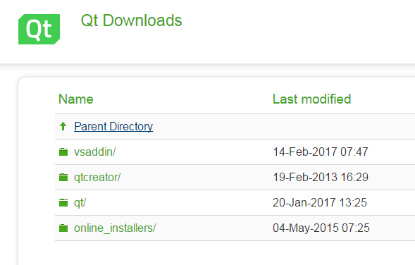
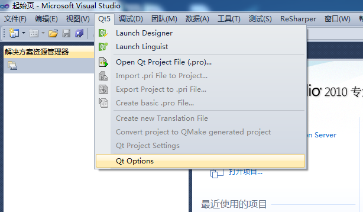
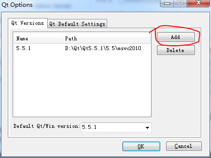
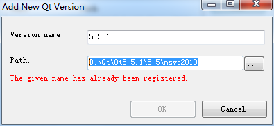
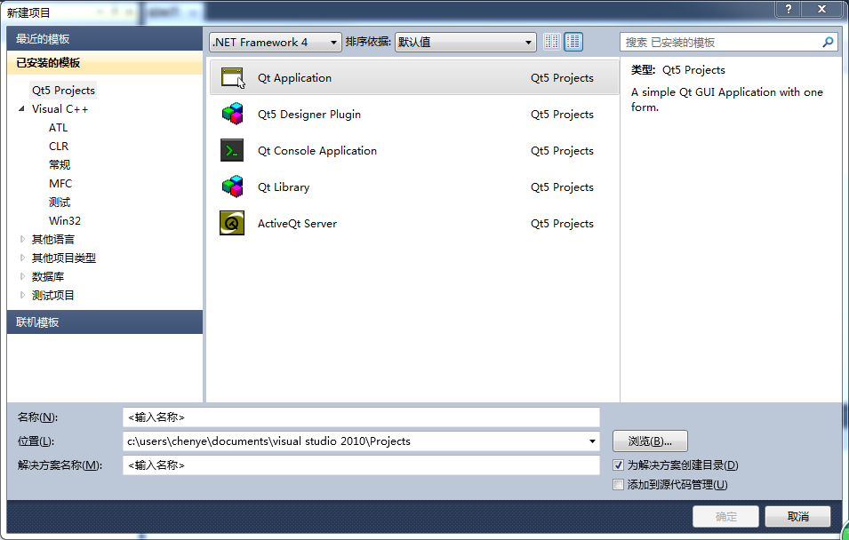

title: "coding记录-20170517"
date: 2017-05-17 22:40:00 +0800
update: 2017-05-17 22:59:00 +0800
author: me
# cover: "-/images/xxx.jpg"
tags:
    - 编程
    - Qt
    - VS
preview: 编程记录:Qt程序的链接库问题；VS2010使用Qt。

---

> 2017-05-17 周三 晴 北京 院里

## Qt程序的dll引用问题 ##
因为电脑里安装了**Qt4.8.1**和**5.7.0**两个版本，所以dll引用要特别注意。因为我把**Qt4.8.1**的目录放在环境变量里了，所以**Qt5**的程序在使用时可能找到的dll不对，比如`libgcc_s_dw2-1.dll`。那么在直接运行程序时就可能产生链接错误。

为解决此问题，把原来添加的环境变量去掉了：

    C:\Qt\4.8.1\bin;C:\Qt\qtcreator-2.4.1\mingw\bin;C:\Qt\qtcreator-2.4.1\bin;

不过这样之后，直接打开**Qt4.8.1**的程序时就需要添加相应的dll文件了。

## VS2010使用Qt ##
为了测试**PanEngin**，试着在**VS2010**中使用Qt。

首先在[http://download.qt.io/archive](http://download.qt.io/archive "http://download.qt.io/archive")下载**Qt的VS版本**和**Qt的VS插件**，支持VS2010的最高Qt版本为**5.5.1**。我下载的是**5.5.1的msvc2010版Qt**和**1.2.4版本的qt-vs-addin**。

然后在电脑里安装Qt和VS插件，安装完成后打开VS2010，已经有Qt5的菜单了。

点击**Qt Options**选项，配置Qt目录。

点击**Add**，添加已经安装的Qt版本，如下图所示。注意添加到**bin**文件夹的上一级。因为我已经添加过了，所以有相关提示。

配置完成后，可以在**Qt5**目录中选择 **Open Qt Project File(.pro)** 打开已有的Qt项目。

也可以通过VS**新建项目**，已经有**Qt Projects**可选了，如下图所示。

