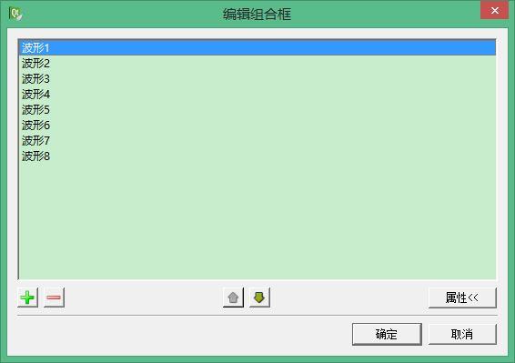
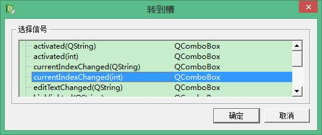

title: "Qt中Combo Box与Plain Text Edit的使用"
date: 2017-06-23 10:00:00 +0800
update: 2017-06-23 11:13:00 +0800
author: me
# cover: "-/images/sangshen.jpg"
tags:
    - 编程
    - Qt
preview: 编程记录:Qt中Combo Box的使用；Plain Text Edit的使用。

---

> 2017-06-23 周五 大雨 北京 院里

## Combo Box的使用##
**Combo Box**就是下拉列表框或者组合框。Qt中**Combo Box**的使用非常简单：首先在Qt Creator里面拖拽一个**Combo Box**到界面上，双击打开编辑窗口，如下图所示。点击左下角的“+”可以添加新的选项，并编辑文字。



然后，为了根据不同选择作出不同的响应，**Combo Box**中提供了很多信号可供使用。选中**Combo Box**并右键，选择“转到槽”，可以找到信号`currentIndexChanged(int)`信号，如下图所示。当选项改变时会发出这个信号，其`int`型参数是**Combo Box**中选项的序号。因此可以利用这个参数判断选择了那一个选项，并实现对应的功能。



## Plain Text Edit的使用 ##
为了实现软件日志显示的功能，使用了**Plain Text Edit**控件。

我感觉Qt中**Plain Text Edit**的功能与**Text Edit**差不多，至少在目前我用到的功能上差不多。

目前我只使用了**Plain Text Edit**的一个功能：`appendPlainText(QString &)`这个函数可以向**Plain Text Edit**添加文本，完全满足了我的需求。

``` cpp
void QPlainTextEdit::appendPlainText ( const QString & text ) [slot]
```

> 注意：**Text Edit**中只有一个`append()`函数，没有`appendPlainText()`。具体两者的不同有待后面继续学习！