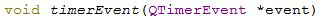

title: "Qt中定时器的使用"
date: 2017-06-24 10:00:00 +0800
update: 2017-06-24 17:50:00 +0800
author: me
# cover: "-/images/sangshen.jpg"
tags:
    - 编程
    - Qt
preview: 编程记录:Qt中定时器的使用。

---

> 2017-06-24 周六 阴 北京 清华

## Qt中定时器的使用 ##
为了实现每隔一定时间执行某一操作的功能，需要用到定时器。

1. Qt中定时器的使用也比较简单，首先声明一个`int`型变量，作为定时器id：
``` cpp
int m_nTimerID;//定时器id
```

2. 然后，添加一个函数`timerEvent`函数，这个函数就是定时每次执行的操作，例如可以每次将timer的id打印出来。
``` cpp
void timerEvent(QTimerEvent *event)  //timerEvent会自动变斜体
{
    qDebug() << QString("timerEvent, id=%1").arg(event->timerId());
}
```
Qt会自动检查到这个函数，并将“timerEvent”变为斜体。


3. 如果要启动定时器，则只需执行`startTimer`函数，其参数代表间隔时间，以ms为单位。
``` cpp
m_nTimerID = startTimer(2000);
```

4. 如果需要停止计时器，则使用`killTimer`函数即可，其参数为定时器的id：
``` cpp
killTimer(m_nTimerID);
```