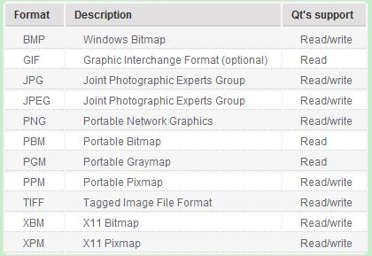

title: "Qt中图像的显示"
date: 2017-07-02 10:00:00 +0800
update: 2017-07-02 11:13:00 +0800
author: me
# cover: "-/images/sangshen.jpg"
tags:
    - 编程
    - Qt
    - 图像
preview: 编程记录:Qt中图像的显示。

---

> 2017-07-02 周日 阴 北京 院里

## Qt中图像的显示 ##
图像显示也是软件中经常有的需求，这里使用了一种非常简单的方法显示图像：利用**label**控件的`setPixmap()`函数和`QImage`类显示图像，只需如下两行代码即可。

``` cpp
QImage *image=new QImage("your image path");
ui->label->setPixmap(QPixmap::fromImage(*image));
```

`QImage`类支持的图像格式如下：
