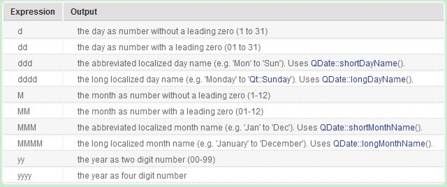
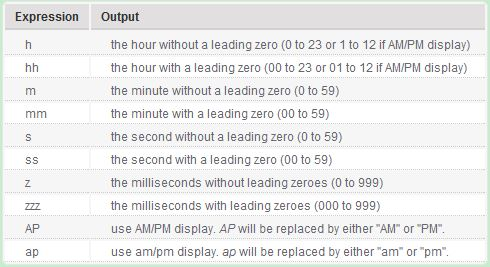
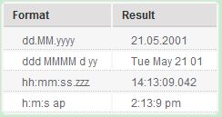

title: "Qt中时间的获取"
date: 2017-07-05 10:00:00 +0800
update: 2017-07-05 11:13:00 +0800
author: me
# cover: "-/images/sangshen.jpg"
tags:
    - 编程
    - Qt
preview: 编程记录:Qt中时间的获取：`QTime`和`QDateTime`类。

---

> 2017-07-05 周三 阴 北京 院里

## Qt中时间的获取 ##
为了获取当前日期和时间，用到了`QTime`和`QDateTime`两个类。

### `QTime`类获取当前时间 ###
利用`QTime::currentTime()`函数可以得到当前时间，得到一个`QTime`对象。通过`toString()`函数可以转换为`QString`类型：

``` cpp
QTime::currentTime().toString()；
```

上面代码得到的结果示例如下，可以看出，只得到了时分秒三个值，没有日期，也没有毫秒。

``` cpp
11:28:28
```
### `QDateTime`类获取当前时间 ###
利用`QDateTime::currentDateTime()`函数同样可以得到当前时间，得到一个`QDateTime`对象。通过`toString()`函数可以转换为`QString`类型：

``` cpp
QDateTime::currentDateTime().toString()；
```

上面代码得到的结果示例如下，可以看出，`QDateTime`类得到的时间信息更多，除了时分秒外还有年月日和星期几。

``` cpp
周四 7月 6 11:38:10 2017
```

### 时间显示格式设置 ###
但是实际使用的时候我们可能需要其他格式的时间信息，不想显示为上面这样，这就需要用到时间格式了。

`toString()`函数可以带有一个`QString`类型的格式参数：

``` cpp
QString QDateTime::toString ( const QString & format ) const
```
其中，日期表达格式如下图所示：


时间表达格式如下图所示：


使用示例如下（假设时间为 `21 May 2001 14:13:09`）：


根据以上格式，设置自己需要的内容：
``` cpp
QDateTime::currentDateTime().toString("yyyy.MM.dd hh:mm:ss.zzz")
```

上面代码得到的结果示例如下，显示日期时间，并且还有毫秒的数据。

``` cpp
2017.07.04 11:37:30.920
```