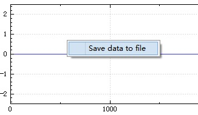

title: "Qt中右键单击后弹出菜单功能"
date: 2017-07-07 10:00:00 +0800
update: 2017-07-07 11:13:00 +0800
author: me
# cover: "-/images/sangshen.jpg"
tags:
    - 编程
    - Qt
preview: 编程记录:Qt中右键单击后弹出菜单功能，使用`customContextMenuRequested(QPoint)`信号和`QMenu`类。

---

> 2017-07-07 周五 晴 北京 院里

## Qt中右键单击后弹出菜单功能 ##
Windows系统中右键单击弹出菜单很常见，下面利用`customContextMenuRequested(QPoint)`信号和`QMenu`类来实现这一功能。

### 1.添加弹出菜单槽函数 ###
利用`QMenu`类可以很容易实现菜单功能，这里通过`addAction()`函数添加一个保存数据的选项“Save data to file”，并将其连接到saveDataToFile()槽函数；`popup()`函数可以将其显示到参数`pos`对应的位置上。

``` cpp
void QCustomPlotPlus::contextMenuRequest(QPoint pos)
{
    QMenu *menu = new QMenu(this);
    menu->setAttribute(Qt::WA_DeleteOnClose);
	//添加保存数据菜单选项，连接到saveDataToFile()槽函数
    menu->addAction("Save data to file", this, SLOT(saveDataToFile()));
    menu->popup(mapToGlobal(pos));
}
```

### 2.连接`customContextMenuRequested(QPoint)`信号 ###
首先利用`setContextMenuPolicy()`函数菜单规则设为`Qt::CustomContextMenu`，这样在鼠标右键单击时便会发出`customContextMenuRequested(QPoint)`信号。然后，连接`customContextMenuRequested(QPoint)`信号和上面添加的槽函数`contextMenuRequest(QPoint)`即可。

``` cpp
setContextMenuPolicy(Qt::CustomContextMenu);
connect(this,
      SIGNAL(customContextMenuRequested(QPoint)),
      SLOT(contextMenuRequest(QPoint)));
```

得到结果如下图所示：
