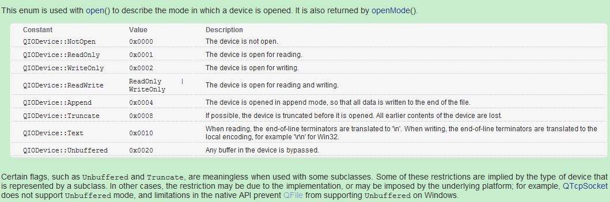

title: "Qt打开文件类型"
date: 2017-07-10 17:00:00 +0800
update: 2017-07-10 17:00:00 +0800
author: me
# cover: "-/images/sangshen.jpg"
tags:
    - 编程
    - Qt
preview: 编程记录：Qt打开文件类型。

---

> 2017-07-10 周一 晴 北京 院里

## Qt打开文件类型 ##
之前写文件一般是覆盖数据，这次需要在文件尾部添加新的数据，所以查阅了一下文档。利用`QFile::open()`函数内的`QIODevice::OpenMode`参数即可实现不同的文件打开模式。

Qt打开文件类型如下图所示。一般读文件用`IODevice::ReadOnly`，覆盖写文件用`IODevice::WriteOnly`，读写都需要则使用`QIODevice::ReadWrite`，而在文件尾部添加新数据则需要`QIODevice::Append`，操作文本文件一般都需要`QIODevice::Text`；


比如，读、覆盖写、尾部写文本文件的代码示例如下：

``` cpp
QFile file(fileName);
//读
file.open(QIODevice::ReadOnly | QIODevice::Text)；
//覆盖写
file.open(QIODevice::WriteOnly | QIODevice::Text)；
//尾部写
file.open(QIODevice::Append | QIODevice::Text)；
```

