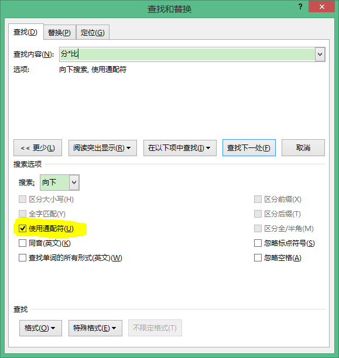

title: "WORD查找功能里通配符的使用"
date: 2017-05-24 10:40:00 +0800
update: 2017-05-24 22:40:00 +0800
author: me
# cover: "-/images/xxx.jpg"
tags:
    - Word
preview: 在Word中怎样使用通配符进行查找。

---

> 2017-05-24 周三 晴 北京 院里

## Word查找中使用通配符
参考此篇文章：[Word的高级查找-通配符用法详解](http://www.officezhushou.com/word2013/659.html)

- 使用?可以代替任意一个符号
- 使用*可以代表任意多个符号
- 使用“[]”，框内的字符可以是指定要查找的字符之一，如：输入“[中美]国”就可以找到“中国”、“美国”。
- 使用“[x-x]”可以指定某一范围内的任意单个字符，如：输入“[a-e]ay”就可以找到“bay”、“day”等字符，要注意的是指定范围内的字符必须用升序。

就用到这么多，具体的可以继续看上面的文章。

**注意**：要在高级查找里，选中“使用通配符”，如下图：

