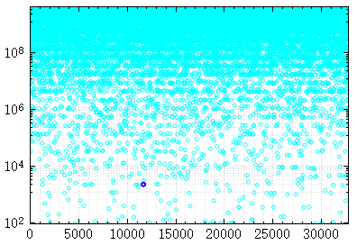

title: "QCustomplot学习笔记1-图形交互"
date: 2017-05-12 16:00:00 +0800
update: 2017-05-12 16:00:00 +0800
author: me
cover: "-/images/qcustomplot0.png"
tags:
    - 编程
    - Qt
    - 作图
    - QCustomPlot
preview: QCustomplot图形交互接口学习。

---

## 简介

QCustomPlot是一个用于Qt作图的函数库，使用十分方便，只需将qcustomplot.h和qcustomplot.cpp两个文件加入工程即可。
在作图时我们经常会有图形交互的需求，例如图形移动、缩放，获取数据点信息等，在这方面QCustomPlot提供了很方便的接口。



## 设置交互类型
QCustomPlot提供了`setInteractions()`函数接口来设置图形的交互类型。如下代码所示，将图形的拖拽、缩放以及数据选择操作设为真。

``` cpp
qcustomplot->setInteractions(QCP::iRangeDrag | QCP::iRangeZoom | QCP::iSelectPlottables);
```
只要设置了`QCP::iRangeDrag`和`QCP::iRangeZoom`，图形边自动具有鼠标拖拽和利用滚轮缩放功能了，十分方便。

## 获取数据点信息
设置了`QCP::iSelectPlottables`后，图形便可以选择了，利用`plottableClick`和`plottableDoubleClick`信号可以对数据的单击和双击响应进行设置。

下面我们通过一个例子，实现单击数据点获取其位置（x坐标）和数据点的值（y坐标）。

首先添加一个槽函数：获取被点击的图的name、数据点的位置、数据点的值输出。
``` cpp
void ClassName::graphClicked(QCPAbstractPlottable *plottable, int dataIndex)
{
  double dataValue = plottable->interface1D()->dataMainValue(dataIndex);
  double dataKey = plottable->interface1D()->dataMainKey(dataIndex);
  QString message = QString("Clicked on graph '%1' at data point #%2 with value %3.").arg(plottable->name()).arg(dataIndex).arg(dataValue);
  qDebug() << message;
}
```

再将鼠标单击信号与槽函数连接即可：
``` cpp
connect(qcustomplot,
            SIGNAL(plottableClick(QCPAbstractPlottable*,int,QMouseEvent*)),
            this,
            SLOT(graphClicked(QCPAbstractPlottable*,int)));
```
